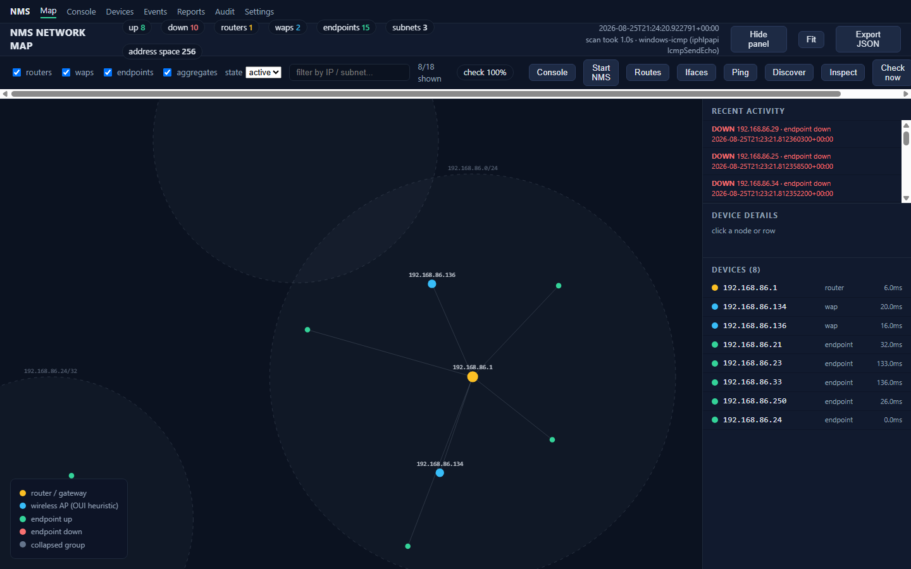
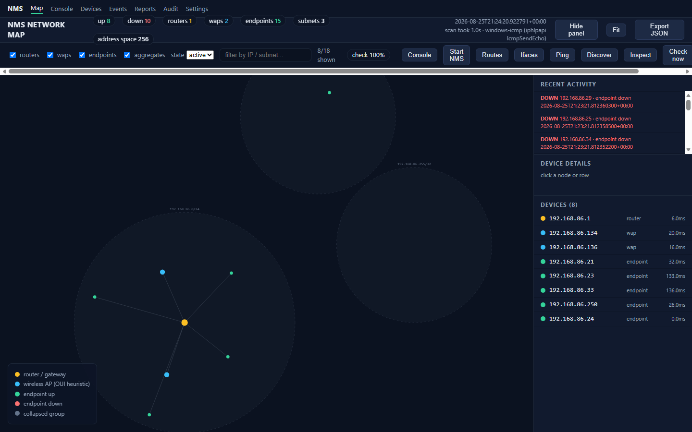
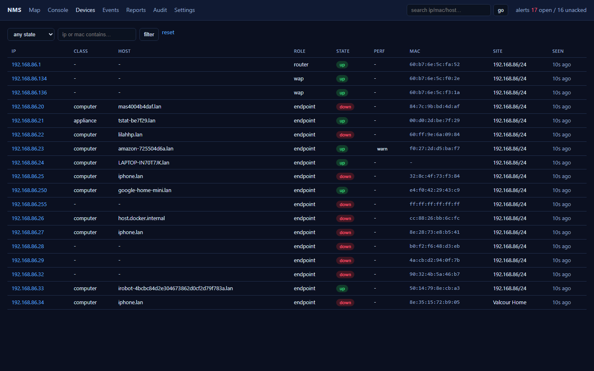
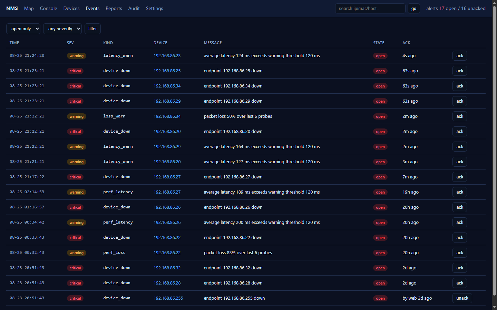
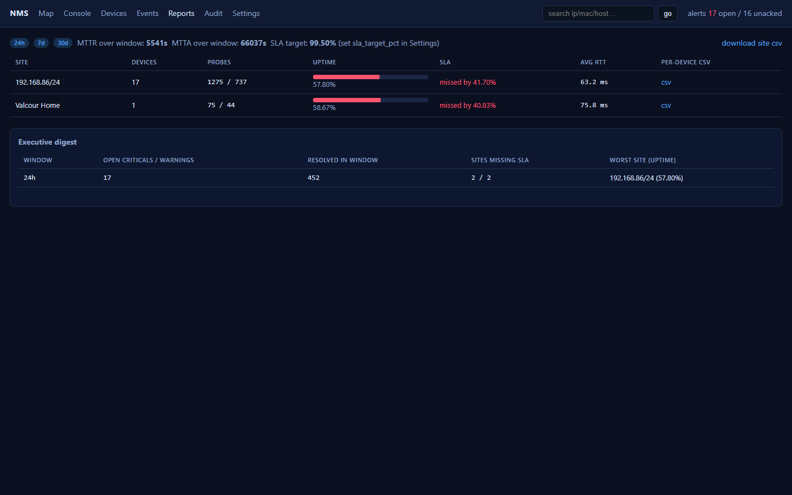
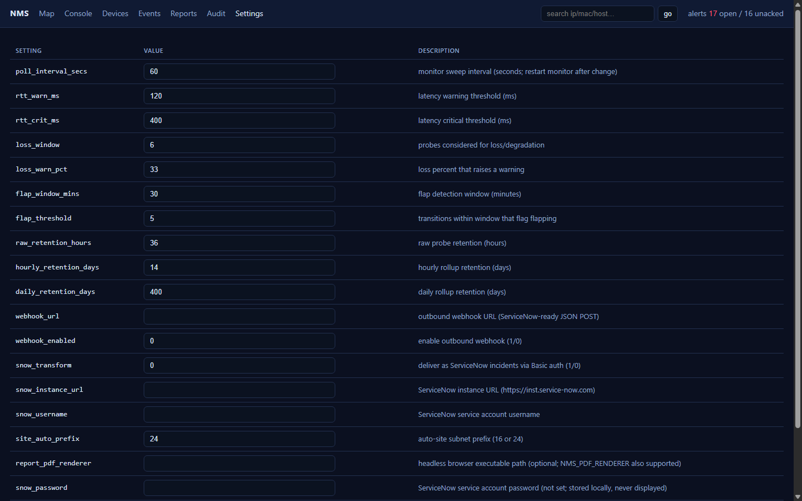

# NMS User Guide

A practical, screenshot-driven guide to using the NMS web console and CLI.
For architecture and requirements, see the [PRD](PRD.md); for API details, see the
[README](../README.md) or the live spec at `/api/openapi.json`.

> **Maintaining this guide:** whenever a new user-visible feature is added to NMS,
> update the relevant section here and re-capture the affected screenshot
> (see [Capturing screenshots](#capturing-screenshots)).

---

## 1. Getting started

### Build and run

```powershell
cargo build --release
target\release\nms.exe serve
```

Open the web console at **http://127.0.0.1:8765**. By default (open mode, loopback
bind) no login is required. For remote or shared use, run hardened mode:

```powershell
nms user add alice --role admin
nms serve --bind 0.0.0.0
```

Roles: **viewer** (read-only), **operator** (ack, maintenance, diagnostics),
**admin** (users, settings), **automation** (API/bearer-token only).

### CLI verbs

| Verb | Purpose |
|---|---|
| `nms discover` | Crawl subnets/routes and build the device inventory |
| `nms check` | One-shot availability sweep |
| `nms monitor` | Continuous monitoring loop (what `serve` runs) |
| `nms inspect <ip>` | Deep diagnostics for one device |
| `nms map` | Export a standalone interactive topology map (`output\map.html`) |
| `nms routes` / `nms ifaces` / `nms ping` | Route table, interface inventory, burst ping |

---

## 2. Web console overview

The top navigation bar gives access to all pages: **Map, Console, Devices,
Events, Reports, Audit, Settings**. The KPI strip shows live counts —
up/down devices, routers, WAPs, endpoints, subnets — plus the last scan time.



### Map

The topology view is the main situational page:

- **Node colors** follow the legend (bottom-left): yellow = router/gateway,
  blue = wireless AP, green = endpoint up, red = endpoint down, gray = collapsed group.
- **Subnet circles** group devices by derived subnet; click a node or a row in the
  right-hand **Devices** panel for details (state, RTT, classification).
- **Filters** (top bar): show/hide routers, WAPs, endpoints, aggregates; filter by
  state (`active` / all) or search by IP/subnet.
- **Actions**: `Check now` forces an immediate sweep; `Discover` re-crawls;
  `Ping`, `Routes`, `Ifaces` run diagnostics on the selected device;
  `Export JSON` downloads the current model; `Fit` re-centers the view.

### Console

The operations dashboard: KPI cards, availability chart, current incidents, and
recent activity. Use this as your daily "is the network healthy?" landing page.



### Devices

Full inventory with classification (router / WAP / endpoint, plus deep profiling
into printer, NAS, server, IoT, etc.), interface counts, last-seen times, and
per-device actions. Search and filter by IP, subnet, type, or state.



### Events

Chronological feed of state changes and alerts. From here you can:

- **Acknowledge** an event (records who/when, silences paging).
- Put a device into a **maintenance window** to suppress expected alarms.
- Downstream devices behind a failed router are collapsed into a single
  root-cause incident automatically.



### Reports

Per-site availability over 24h / 7d / 30d windows, MTTR, and CSV export.
Daily HTML/PDF reports can be scheduled (rendered via headless Edge/Chrome).



### Settings

Monitoring cadence, thresholds (latency/degraded), discovery options, webhook /
ServiceNow integration targets, and (in hardened mode) user management.



---

## 3. Typical workflows

### First discovery

1. `nms discover` — crawls interface subnets and routes, classifies devices,
   derives sites.
2. Open **Map** to review the topology; correct any misclassified devices.
3. `nms serve` (or `nms monitor`) to start continuous sweeps.

### Handling an outage

1. Watch **Console** for a new incident (root-cause collapsed).
2. Open **Map**, click the red node; run `Ping` / `Inspect` for diagnostics
   (burst-ping loss/jitter, traceroute, port checks).
3. **Acknowledge** in **Events** once handled; MTTR is captured in **Reports**.

### Planned maintenance

Create a maintenance window for the affected device(s) *before* the change so
alarms and webhooks are suppressed, then let it expire (or end it early) after.

### Integrations

Point a webhook at your ticketing system (ServiceNow supported, including direct
Basic-auth incident creation). Events are queued with retries.

---

## 4. Capturing screenshots

Screenshots in this guide live in `docs/images/` and were captured with headless
Edge while the console was running:

```powershell
target\release\nms.exe serve        # in one shell
& "C:\Program Files (x86)\Microsoft\Edge\Application\msedge.exe" `
  --headless --disable-gpu --window-size=1440,900 `
  --screenshot="$PWD\docs\images\map.png" http://127.0.0.1:8765/map
```

When adding a feature with new UI, capture the new page/state and embed it here.
