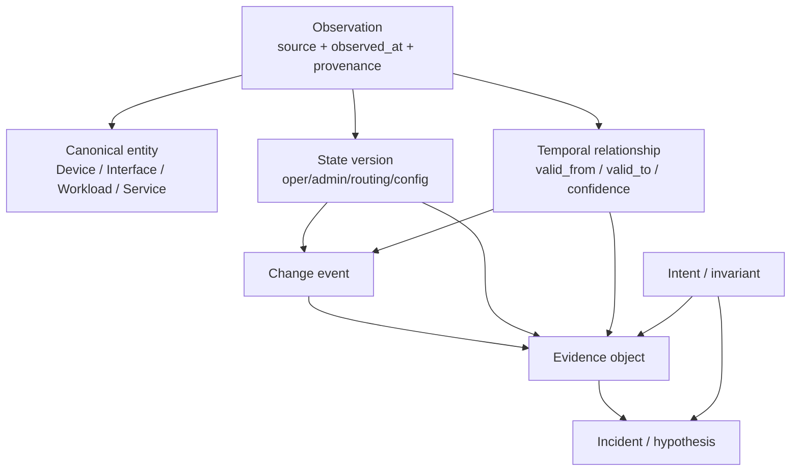
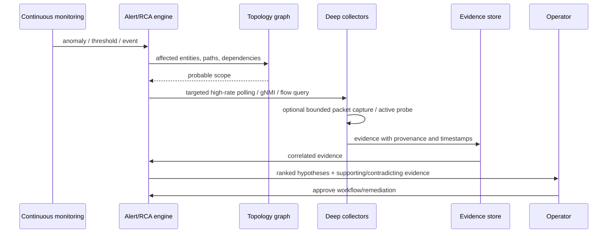
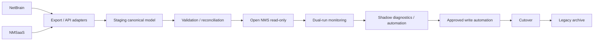
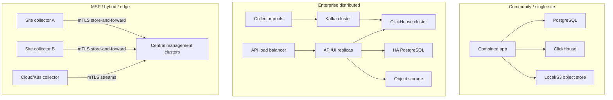

# Open-Source Network Management System PRD and Design Blueprint

## Executive summary

The recommended product is not merely an open-source clone of NetBrain or NMSaaS. It should combine three historically separate product categories into one coherent platform: **traditional network management** for continuous availability/performance/fault/configuration monitoring; **NetBrain-style dynamic diagnostics and network digital-twin capabilities** for topology, path, intent, and automated troubleshooting; and **modern observability/security telemetry** spanning flows, packets, streaming telemetry, clouds, Kubernetes, service meshes, and identity-aware policy. NetBrain itself explicitly positions its deep diagnostic collection and dynamic mapping as complementary to traditional 24×7 monitoring rather than as an NMS replacement, while NMSaaS emphasizes conventional discovery, inventory, performance, fault/event, configuration/change, policy, vulnerability/EOL, reporting, SNMP, NetFlow, and WMI functions. That gap creates the central opportunity: build one open platform that does both. citeturn0search6turn1search4turn1search17

The target architecture should be **distributed, event-driven, model-driven, and hybrid agentless/agent-based**. Device management should remain agentless whenever standards already expose the required information—SNMPv3, gNMI, NETCONF/YANG, RESTCONF, SSH, flow export, syslog, BMP, BGP-LS—while lightweight edge agents or eBPF-based sensors should be optional for packet visibility, endpoint telemetry, cloud-host visibility, synthetic testing, and Kubernetes workloads. gNMI provides a particularly important basis because it unifies configuration retrieval/modification with subscription-based telemetry over gRPC, while the IETF Network Telemetry Framework explicitly recognizes the evolution from older management approaches toward richer push/streaming telemetry. citeturn2search3turn2search14turn15search16

A strong default implementation is:

**Go** for collectors, ingest services, protocol adapters, scheduling, and performance-sensitive back-end services; **Python** for automation, analytics, ML, workflow extensions, and the public scripting SDK; **TypeScript/React** for the web UI; **PostgreSQL** for authoritative inventory/control-plane metadata; **ClickHouse** for high-volume metrics, events, flows, and analytics; **S3-compatible object storage** for packet captures, configuration snapshots, reports, model artifacts, and cold telemetry; **Kafka** for durable event-stream decoupling; **OpenSearch only where full-text/search workloads justify the operational cost**; and **OpenTelemetry + Prometheus** for observing the NMS itself. ClickHouse's continuously maintained materialized views, TTLs, and time-series rollups map particularly well to telemetry retention and downsampling, while Kafka provides replicated, replayable event streams between collectors and analytics services. citeturn18search1turn18search5turn18search17turn7search2turn7search14

Existing open-source projects should be treated as **building blocks and compatibility targets, not as the product architecture**. OpenNMS already demonstrates broad fault/performance/traffic/event capabilities and distributed telemetry; LibreNMS provides mature SNMP discovery, distributed polling, alerting, API support, and broad device coverage; NetBox provides an Apache-2.0 network source-of-truth model and plugin/API ecosystem; Batfish contributes model-based configuration and reachability analysis; SuzieQ demonstrates multivendor state normalization; Oxidized provides multivendor configuration archival; gNMIc supplies a capable OpenConfig collector; pmacct and GoFlow2 cover flow telemetry; and Zeek/Suricata cover packet-derived network security observations. citeturn8search20turn8search1turn8search3turn9search3turn9search1turn9search2turn15search0turn15search2turn15search5turn15search3turn17search6

The product should deliberately distinguish **monitoring** from **observability**. Monitoring asks whether known indicators cross known thresholds; observability lets an operator explain an unexpected condition by joining telemetry with topology, configuration, paths, changes, dependencies, identities, and service context. OpenTelemetry formalizes observability in terms of understanding a system's internal state through its outputs, while NetBrain similarly argues for correlating telemetry with topology and configuration rather than stopping at alarms. citeturn7search13turn0search9

The key competitive differentiator should therefore be a **temporal network knowledge graph plus evidence-based diagnostic engine**: every device, interface, route, link, tunnel, service, endpoint, cloud resource, configuration, policy, metric, alert, and inferred relationship has provenance and time validity. An incident should be explainable as a chain such as:

`service degradation → path changed → BGP next-hop changed → configuration commit → policy difference → affected links/interfaces → corroborating latency/loss/flow evidence`.

This is a design inference supported by research showing the value of network-wide packet histories, query-driven telemetry, differential network analysis, and closed-loop monitoring/diagnosis. NetSight demonstrated network-wide packet histories for troubleshooting; Sonata moved toward query-driven collection; Differential Network Analysis treats changes as first-class objects when calculating behavioral differences; and SpiderMon showed the benefit of triggering selective deeper telemetry from an initial symptom rather than continuously collecting everything. citeturn21search0turn21search1turn22search1turn22search2

The project should be **fully open source rather than open-core**. My default recommendation is Apache License 2.0 for the core, agents, UI, protocol SDKs, and official plugins, coupled with a Developer Certificate of Origin, public architecture decision records, elected technical steering, published compatibility tests, and a strict rule that enterprise-critical capabilities such as HA, RBAC, multi-tenancy, security, and APIs never become proprietary editions. Apache-2.0 permits broad reuse and includes an explicit patent grant; the DCO provides a lightweight declaration that contributors have rights to submit their work. MPL-2.0 is an alternative where file-level copyleft is desired; AGPLv3 is appropriate only if preventing closed hosted derivatives outweighs the additional adoption friction. citeturn19search3turn20search0turn20search1turn20search10

**Planning assumption:** without a stated budget or target device count, this PRD assumes a three-tier architecture: a small deployment at roughly 1,000 devices; a normal enterprise deployment around 10,000 devices/500,000 monitored interfaces; and a scale-validation target of approximately 100,000 devices and several million interfaces. Those are design targets, not measured capacities of the proposed software. NMSaaS itself advertises deployments up to 75,000-plus devices, so a replacement intended to surpass it should not hard-code assumptions that stop at a few thousand devices. citeturn0search4turn1search5

A credible production MVP can be reached in roughly **nine to twelve months with 10–14 experienced people**, but a genuinely broad NetBrain/NMSaaS-class GA should be planned as an **18–30 month, roughly 265–425 person-month program**, followed by continuous device compatibility work. These are engineering estimates from the scope below, not vendor benchmarks. The highest-risk work is not generic CRUD or dashboards—which AI coding assistants can accelerate—but multivendor normalization, topology/path correctness, scale, configuration safety, protocol edge cases, hardware-lab testing, and trustworthy automated diagnosis.

## Market baseline, assumptions, and product principles

NetBrain's strongest product concept is the **dynamic network map/digital twin**. Its current materials describe on-demand A-to-B maps, topology/path/device-state overlays, “golden” comparisons, hybrid-cloud visibility, cloud/Kubernetes integration, third-party monitoring and ITSM integrations, and no-code diagnostic automation. It also describes integrations with monitoring, CMDB, ITSM, security, cloud, and Kubernetes systems through APIs and webhooks. citeturn0search1turn0search5turn0search12turn0search15turn0search22

NMSaaS is much closer to a classic unified NMS: its official pages enumerate network discovery, inventory/mapping, performance, event/fault, configuration/change, policy, vulnerability/EOL, and integration capabilities, including SNMP, NetFlow, and WMI monitoring and numerous reporting options. Its official claims include support for environments from hundreds through tens of thousands of devices; those scale figures should be considered vendor claims rather than independently validated benchmarks. citeturn1search4turn1search5turn1search10

The replacement should therefore aim at the following comparative position:

| Capability domain | NetBrain baseline | NMSaaS baseline | Proposed open platform |
|---|---|---|---|
| Always-on availability/performance NMS | NetBrain says it complements rather than replaces traditional 24×7 monitoring. citeturn0search6 | Core product function using SNMP/NetFlow/WMI and fault/event tooling. citeturn1search4turn1search5 | First-class distributed polling, streams, flows, synthetic tests, event correlation and SLA engine. |
| Dynamic topology/maps | Major differentiator: dynamic A-B maps, path/context overlays and golden comparisons. citeturn0search1turn0search12turn0search22 | Discovery, inventory and mapping are included. citeturn1search17 | Temporal multilayer graph covering L1/L2/L3, overlays, route/control-plane state, services, clouds and Kubernetes. |
| Troubleshooting automation | Intent-based/no-code diagnosis and runbooks are central. citeturn0search3turn0search20 | More conventional NMS workflows/integrations. citeturn1search10 | Evidence-producing workflow engine, pre/post checks, differential analysis, causal ranking and safe remediation. |
| Configuration/change | Diagnostic/change-protection emphasis. citeturn0search20 | Explicit configuration/change and policy functionality. citeturn1search17 | Git-like snapshots/diffs, normalized configuration models, compliance, approvals, verification and rollback. |
| Hybrid/cloud/Kubernetes | AWS/Azure/GCP/Kubernetes visibility and application-path integration. citeturn0search5 | Vendor-agnostic cloud SaaS management positioning. citeturn1search10 | Native cloud APIs, flow logs, K8s/CNI/eBPF, service mesh, identities and cloud-route graph. |
| Flows/packets/security | Integrates with security tooling; not positioned as IDS/SIEM. citeturn0search6turn0search15 | NetFlow plus vulnerability/EOL functionality. citeturn1search3turn1search17 | Native NetFlow/IPFIX/sFlow, optional packet capture, Zeek/Suricata integration, microsegmentation analytics and security posture. |
| Extensibility | REST/webhooks and integrations. citeturn0search15 | Integration-oriented NMS. citeturn1search10 | API-first, versioned OpenAPI/gRPC/events, Python/Go SDKs, plugin contracts and normalized schema. |
| Licensing/governance | Proprietary | Commercial SaaS | OSI-approved license, public roadmap/tests/governance, no feature-gated proprietary edition. citeturn20search7turn19search3 |

**Core design principles.** The platform should be topology-first, API-first, evidence-first, secure-by-default, vendor-neutral, horizontally partitionable, and “progressively deep”: cheap signals run continuously and expensive collection activates when evidence warrants it. This last principle is especially important because contemporary telemetry research repeatedly addresses the cost of collecting everything. Sonata coordinates collection and stream processing based on queries; SpiderMon triggers targeted deeper collection; FlowRadar and later sketch-oriented work explore more compact representations; Meta's “Evolvable Network Telemetry” work emphasizes that production telemetry itself must evolve as networks and consumers change. citeturn21search1turn21search2turn22search2turn22search17

**Product personas** should include the NOC operator, network engineer, network architect, SRE/platform engineer, cloud/Kubernetes engineer, security analyst, compliance auditor, MSP operator, automation engineer, executive/service owner, and developer integrating the platform. Roles must not simply correspond to UI permissions; they should govern accessible tenants/sites/devices, credential usage, capture payload visibility, configuration-write privileges, workflow execution, evidence export, and AI actions.

**Assumed scale tiers for design and testing:**

| Tier | Approximate planning target | Intended deployment |
|---|---:|---|
| Community | ≤1,000 devices; ≤50k interfaces; ≈10k telemetry samples/s | Single server or small HA cluster |
| Enterprise | ≈10,000 devices; ≈500k interfaces; ≈100k telemetry samples/s plus significant flow/event traffic | Distributed on-prem/private cloud |
| Large/MSP | ≈100,000 devices; millions of interfaces; ≈1M metric samples/s and potentially comparable or greater flow rates | Sharded multi-cluster installation |

These are **PRD test targets**, not promised throughput. Actual ingest volume depends far more on telemetry cardinality, subscription intervals, interface count, flow export rates, sampling, labels, and packet retention than on device count alone.

The central product object should be a **Network Intent**. An intent combines a scope, desired invariant, evidence requirements, severity, runbook, optional remediation, and SLO—for example, “Branch sites must have two independent paths to DNS,” “PCI endpoints may not reach management VRFs,” or “application A must maintain <50 ms p95 RTT between locations.” This generalizes NetBrain-style intent diagnostics into an open, versionable object rather than baking troubleshooting logic into proprietary workflows. NetBrain's current platform explicitly emphasizes intent-based diagnosis and an intent repository, providing useful precedent for this abstraction. citeturn0search3turn0search20

## Comprehensive PRD feature inventory

The tables below are intended as implementable product requirements. In each row, **F** means functional requirement; **NF** means non-functional requirement; **Data/Tel** means data model and telemetry; **Proto/Lang** identifies protocols and implementation-facing languages; **Sec/Int** covers security and integration; and **Test/KPI** defines verification and success measures.

| Capability | Purpose and user story | Requirements | Data/Tel; protocols and languages | Security and integration | Testing, KPI and implementation options |
|---|---|---|---|---|---|
| **Real-time monitoring** | *Purpose:* continuously expose health/state. *Story:* “As a NOC operator, I see failures and degradations within seconds and can pivot to affected services and paths.” | **F:** live counters/state, health rollups, threshold/state rules, dependency impact, drilldown. **NF:** stream-event p95 processing target <10 s; graceful overload; ordered per-source state where needed. | `MetricSeries`, `StateObservation`, `Health`; gNMI, traps, syslog, APIs, synthetic probes. Go ingest; SQL/PromQL-style query surface. Modern gNMI supports subscription telemetry over gRPC. citeturn2search3turn7search13 | mTLS/credential isolation; monitoring APIs; ITSM/SIEM/webhooks. | Replay, burst, clock-skew and fault-injection tests. KPI: collection success, freshness, late/drop rate, detection latency, false alarm rate. Implement using Go collectors + Kafka + ClickHouse. |
| **Polling** | *Purpose:* universal baseline where push telemetry is absent. *Story:* “As an engineer, legacy and modern devices are monitored without endpoint agents.” | **F:** distributed schedulers, jitter, GETBULK, adaptive intervals, per-device concurrency/rate budgets, timeout/backoff, HA ownership. **NF:** no synchronized polling storms; predictable completion windows. | `PollJob`, `PollResult`, `Capability`; primarily SNMPv3, ICMP, HTTP, SSH/CLI, NETCONF/RESTCONF. SNMP architecture and SNMPv3 security are standardized by RFCs 3411/3414/3415. citeturn2search0turn2search4turn2search8 | SNMPv3 authPriv default; prohibit network-wide v2c defaults and write communities. | Emulator/device-lab matrices; induced latency/loss. KPI: poll completion %, duration, device load, retries and missed intervals. OpenNMS/LibreNMS provide useful distributed-polling design precedent. citeturn8search5turn8search20 |
| **Streaming telemetry** | *Purpose:* obtain high-frequency state without repeated polling. *Story:* “As an engineer, I subscribe to interface/queue/routing state at operationally useful rates.” | **F:** ON_CHANGE, SAMPLE and target-defined subscriptions; schema negotiation; reconnect/resume; dynamic subscription templates; backpressure. **NF:** millions of updates/s via horizontal shards. | `TelemetrySubscription`, `TelemetrySample`, schema/path metadata; gNMI/gRPC, OpenConfig/YANG, vendor streams, optional MQTT/Kafka. gNMI defines Get/Set/Subscribe; MQTT is an OASIS lightweight pub/sub standard. citeturn15search16turn14search3 | TLS/mTLS, target identity, subscription authorization. | Compatibility tests by vendor/NOS/version; reconnect and malformed-update fuzzing. KPI: update lag, gaps, bytes/sample, collector CPU. gNMIc can be reused or used as a reference implementation. citeturn15search0 |
| **Flow analysis** | *Purpose:* explain who communicates with whom and where capacity goes. *Story:* “As a capacity/security engineer, I find top applications, talkers, ASNs and unexpected traffic paths.” | **F:** ingest/exporter normalization, deduplication, sampling normalization, enrichment, top-N, conversation search, baselines, traffic matrices. **NF:** high-cardinality analytics and bounded storage. | `Flow`, `FlowExporter`, `Conversation`; NetFlow 5/9, IPFIX, sFlow, cloud flow logs. IPFIX separates export protocol and information model; sFlow uses statistical sampling. citeturn2search1turn2search9turn2search2 | Treat IP/user/app metadata as potentially sensitive; tenant partitioning and configurable anonymization. | Golden packet/flow fixtures, template churn, exporter reset and sampling tests. KPI: flows/s, decode errors, unknown interfaces, storage/flow, query latency. GoFlow2 or pmacct are strong options. citeturn15search5turn15search2 |
| **Packet capture** | *Purpose:* provide decisive evidence when aggregated telemetry is insufficient. *Story:* “As a troubleshooter, I trigger bounded packet capture around an incident without operating a permanent full-packet surveillance platform.” | **F:** ring buffers, triggered capture, BPF filters, headers-only/payload policy, distributed capture agents, PCAP/PCAPNG export. **NF:** hard bandwidth/disk quotas; capture must fail safely under overload. | `CaptureJob`, `CaptureSegment`, metadata/object URI; libpcap/AF_PACKET/eBPF/AF_XDP/DPDK where justified. Zeek consumes live traffic or PCAP; Suricata supports live traffic and PCAP analysis. citeturn15search7turn17search2 | Most sensitive subsystem: explicit roles, reason/audit trail, encryption, retention/hold policy and payload redaction. | PCAP fixture suites, line-rate loss tests, privacy tests. KPI: packet drop %, capture startup time, bytes retained, diagnosis yield. Zeek and Suricata should enrich rather than replace raw capture. |
| **Topology discovery** | *Purpose:* create authoritative observed network relationships. *Story:* “As an operator, devices and links appear automatically with confidence/provenance.” | **F:** seed/credential discovery, neighbor expansion, IP/MAC/ARP/FDB correlation, LLDP/CDP, routes, tunnels, cloud and K8s relations; conflict resolution. **NF:** eventual consistency and explainable provenance. | `Node`, `Interface`, `Link`, `NeighborObservation`, validity ranges; SNMP, LLDP/CDP, ARP/FDB, routing protocols, cloud APIs, K8s API. LibreNMS demonstrates discovery using LLDP/CDP/BGP/OSPF/SNMP/ARP. citeturn8search1 | Discovery scopes and credential bounds; prevent accidental Internet sweeps. | Synthetic topologies and physical labs; compare expected/observed edges. KPI: precision/recall of links, stale-object rate, convergence time. |
| **Mapping** | *Purpose:* transform inventory into usable contextual views. *Story:* “As an engineer, I generate a live map around an incident, site, application or A-B path.” | **F:** dynamic maps, saved views, overlays, grouping, temporal snapshots, golden/live difference. **NF:** usable at hundreds of displayed nodes while full graph remains much larger. | `MapView`, filters, layouts, `TopologySnapshot`; graph API. NetBrain's dynamic A-B maps and golden-path comparison establish useful behavioral expectations. citeturn0search12turn0search22 | Map access inherits underlying object authorization. | Snapshot/UI regression, graph-diff and large-layout performance tests. KPI: map build p95, stale-edge rate, operator clicks/time-to-context. Cytoscape.js/Sigma-like libraries are suitable UI options. |
| **Visualization** | *Purpose:* make heterogeneous telemetry comprehensible. *Story:* “I move from service → topology → path → interface → raw evidence without changing tools.” | **F:** time series, tables, heatmaps, dependency graphs, route/path views, geographic maps, diff/timeline. **NF:** progressive rendering and browser memory budgets. | API projections rather than client-side joins; JSON/Protobuf internally, REST/GraphQL externally. | Hide restricted payloads/fields; export authorization. | Visual regression, 100k-object API tests, accessibility keyboard/screen-reader tests. KPI: web vitals, query latency, task completion. |
| **Path analysis** | *Purpose:* answer “how can/does traffic get from A to B?” *Story:* “As an engineer, I see ECMP alternatives, VRFs, tunnels, policy and route causes—not only traceroute hops.” | **F:** modeled forwarding paths plus observed probes; ECMP, VRF, ACL, NAT, MPLS/SR/tunnel overlays; historical and golden-path diff. **NF:** provenance on every inferred hop. | `Path`, `PathHop`, route/RIB/FIB/policy relationships; routing tables, BGP, BGP-LS, cloud routes, traceroute, Batfish. BGP-LS distributes link-state/TE information; PCEP provides path computation/control interfaces. citeturn3search1turn3search5 | No automatic assumption that modeled reachability equals security authorization. | Known-topology paths, loops/blackholes, ECMP and differential snapshots. KPI: modeled-vs-probed agreement and path computation latency. Batfish is a strong verification engine. citeturn9search3turn9search0 |
| **Automation** | *Purpose:* convert diagnosis into repeatable data collection and safe action. *Story:* “As an engineer, I encode expert troubleshooting once and run it consistently.” | **F:** DAG/workflow engine, read/write steps, parallelism, approvals, dry-run, checkpoints, rollback/compensation, scheduled/event-triggered execution. **NF:** deterministic audit and idempotent steps. | `Workflow`, `Step`, `Execution`, `Evidence`; Python SDK, YAML/JSON declarative format; SSH, REST, NETCONF, gNMI Set. Nornir is a Python network automation framework; Ansible separates device-specific modules from reusable automation. citeturn16search0turn16search2 | Credential references, scoped execution identities, four-eyes approval, signed artifacts. | Simulators, chaos/partial-failure tests, read-only production canaries. KPI: success %, rollback %, manual minutes eliminated, incident MTTR change. Nornir/NAPALM/Ansible adapters are practical. citeturn17search1 |
| **Root-cause analysis** | *Purpose:* rank likely causes with evidence rather than correlate timestamps blindly. *Story:* “As an operator, the alert explains which change/failure probably caused the symptom and what contradicts that hypothesis.” | **F:** dependency graph, symptom propagation, topology-aware suppression, temporal/change correlation, active checks, hypothesis/evidence/contradiction scoring. **NF:** every conclusion must be explainable and uncertainty-labelled. | `Incident`, `Hypothesis`, `Evidence`, graph paths; all telemetry plus changes/config/path/service dependencies. Research on packet histories, temporal/differential network analysis and closed-loop diagnosis supports such evidence-centric designs. citeturn21search0turn22search1turn22search2 | AI cannot silently turn inference into write permission. | Seeded failure corpus, blinded expert evaluation, counterfactual tests. KPI: top-1/top-3 cause precision, time-to-cause, evidence completeness, operator acceptance. |
| **Alerting** | *Purpose:* notify on actionable conditions, not raw samples. *Story:* “As an on-call engineer, one incident represents the outage instead of hundreds of port alerts.” | **F:** threshold/state/anomaly/absence/composite rules, dedupe, grouping, dependency suppression, maintenance, routing/escalation, acknowledgment. **NF:** deterministic evaluation; alerts survive worker failover. | `Rule`, `Alert`, `Incident`, notification state; metrics/events/topology/intent. Syslog RFC 5424 supplies standardized event messages and TLS transport is defined separately. citeturn14search0turn14search12 | Prevent notification leakage across tenants; signed/authenticated outbound integration where possible. | Rule fixtures, storms, maintenance and failover. KPI: actionable-alert ratio, duplicate reduction, detection and delivery latency. |

| Capability | Purpose and user story | Requirements | Data/Tel; protocols and languages | Security and integration | Testing, KPI and implementation options |
|---|---|---|---|---|---|
| **SLA/SLO management** | *Purpose:* measure user/service outcomes. *Story:* “As a service owner, I know availability, latency/loss and error-budget consumption per service/location.” | **F:** service objectives, calendars, exclusions, probes, burn rates, compliance reports. **NF:** reproducible historical calculations. | `Service`, `SLI`, `SLO`, `SLAWindow`, `ProbeResult`; ICMP/TCP/HTTP/DNS, IP-SLA/vendor probes and passive indicators. | Customer/tenant-specific service definitions. | Boundary/time-zone tests; probe failure simulation. KPI: SLO attainment, error-budget burn, probe coverage and measurement completeness. |
| **Capacity planning** | *Purpose:* forecast saturation and justify upgrades. *Story:* “As a planner, I see when interfaces/circuits/links will breach policy.” | **F:** percentile utilization, headroom, seasonality, trend/forecast, scenario modeling, flow contributors. **NF:** rollups must preserve relevant peaks/percentiles. | Metric/flow rollups, circuit/link/service capacity. ClickHouse materialized rollups and TTL policies directly support multi-resolution analytics. citeturn18search17turn18search5 | Financial/carrier metadata may have restricted roles. | Backtesting forecasts and synthetic growth. KPI: forecast error, days-to-capacity, avoided emergency upgrades. |
| **Configuration management** | *Purpose:* collect, compare and safely modify network configuration. *Story:* “I retrieve the exact configuration, propose a change, preview diff, validate and commit.” | **F:** scheduled/event fetch, structured/raw config, candidate diff, merge/replace, approvals, commit-confirm/rollback where supported. **NF:** immutable snapshots and full provenance. | `ConfigSnapshot`, `ConfigTree`, `ChangePlan`; NETCONF/YANG, RESTCONF, gNMI Set, APIs, SSH/CLI. NETCONF and YANG standardize configuration/state manipulation and models; RESTCONF exposes YANG over HTTP. citeturn4search0turn4search1turn3search3 | Separate read/write credentials; secrets stripped; destructive operations require policy. | Vendor labs and rollback exercises. KPI: backup freshness, successful change %, rollback %, config parse coverage. Oxidized and NAPALM are useful components. citeturn9search2turn17search1 |
| **Change tracking** | *Purpose:* make every network-state transition searchable and attributable. *Story:* “As incident responder, I ask what changed in the affected path during the last hour.” | **F:** config, topology, route, cloud/K8s and policy changes; diff/timeline; correlation to incidents. **NF:** immutable/append-only evidence. | `ChangeEvent`, before/after references, actor/source, validity. Differential analysis should treat changes as first-class inputs. citeturn22search1 | Tamper-evident audit; protect actor metadata. | Replay historical changes and check diffs. KPI: detected-change completeness, attribution %, time from change to observation. |
| **Compliance** | *Purpose:* continuously test desired configuration/security intent. *Story:* “As an auditor, I obtain evidence that required settings existed throughout an audit period.” | **F:** rule packs, versioning, exceptions/expiry, remediation guidance, evidence bundles, CIS/vendor/custom policies. **NF:** reproducible evaluation. | `ComplianceRule`, `Finding`, `Exception`, `Evidence`; parsed config/YANG/cloud/K8s policy. NIST SP 800-128 explicitly focuses on security configuration management and monitoring configurations to reduce risk. citeturn13search13 | Signed policy revisions; audit-role separation. | Known-good/bad configuration corpus. KPI: compliant %, time-to-remediate, exception age, false-positive rate. OPA/Rego can implement portable policy rules. citeturn19search5 |
| **Security monitoring** | *Purpose:* detect network-relevant threats/misconfigurations alongside availability faults. *Story:* “As security analyst, I correlate IDS findings with communicating hosts, topology and configuration.” | **F:** ingest IDS, auth, firewall, flow and vulnerability events; east-west relationship analytics; threat enrichment; segmentation violations. **NF:** maintain boundary between detection evidence and automated blocking. | `SecurityFinding`, `Identity`, `Conversation`, `PolicyDecision`; Zeek, Suricata, firewall APIs, syslog, flows. Suricata supports IDS/IPS/network-security monitoring; Zeek produces rich transaction logs from live traffic. citeturn17search6turn15search7 | High-sensitivity RBAC and data retention. | PCAP attack corpora/rule tests. KPI: signal precision, enrichment coverage, detection-to-context latency. |
| **Anomaly detection** | *Purpose:* find novel deviations without static thresholds for every metric. *Story:* “As an operator, I am warned when a peer/interface/site departs materially from its normal seasonal/peer behavior.” | **F:** robust z-score/MAD, EWMA/CUSUM, seasonal baselines, peer groups, change points and optional Isolation Forest; feedback loop. **NF:** models must tolerate missing/restarted counters and topology changes. | Feature windows tied to entity/context; metrics, flows, events. Isolation Forest's original method explicitly isolates anomalies rather than first modeling normal points. citeturn22search0 | Avoid learning across tenants without explicit opt-in; explain features contributing to score. | Backtesting on labeled incidents plus synthetic anomalies. KPI: precision/recall, alert volume, detection lead time, drift. Start statistical, add ML only where it wins. |
| **ML/AIOps** | *Purpose:* assist diagnosis, summarization, forecasting and workflow authoring—not substitute hallucination for evidence. *Story:* “I ask why a service failed and receive a cited answer linked to actual graph/config/telemetry evidence.” | **F:** retrieval/tool execution against platform APIs, incident summarization, hypothesis ranking, natural-language query, runbook suggestions; human approval for write actions. **NF:** evidence citation, reproducibility, model/version logging and graceful no-LLM mode. | `AIInteraction`, tool calls, evidence IDs, model metadata; Python ML stack plus optional LLM provider/local model. | Prompt-injection isolation, least-privilege tools, secret filtering, tenant isolation, policy gate on actions. | Grounded-QA benchmark, red-team, tool-permission and hallucination tests. KPI: factual-grounding %, expert acceptance, MTTR improvement, unsafe action rate = zero target. |
| **Multi-vendor** | *Purpose:* eliminate vendor-specific UI/workflow silos. *Story:* “A VLAN/interface/BGP neighbor has one canonical representation independent of NOS.” | **F:** capability registry, canonical models, per-platform adapters, version matrices and graceful unknown fields. **NF:** unsupported data must remain visible rather than silently discarded. | OpenConfig/YANG canonical models plus raw vendor extensions. NAPALM deliberately provides a unified multivendor interaction API; SuzieQ normalizes state vendor-independently. citeturn17search1turn9search1 | Drivers run with least privilege and preferably process isolation. | Hardware/virtual-NOS CI matrix. KPI: devices/OS versions supported, normalized-field coverage, parser error rate. |
| **Multi-cloud** | *Purpose:* include cloud networking in the same topology/path/service model. *Story:* “I trace connectivity from branch router through VPN/transit/VPC/VNet to cloud workload.” | **F:** AWS/Azure/GCP inventory/routes/security/policy/flow ingest; account/subscription/project discovery; cross-cloud graph. **NF:** API throttling awareness and incremental sync. | Cloud resource entities; AWS VPC/TGW flow logs, Azure VNet flow logs, GCP VPC Flow Logs/Network Intelligence data. AWS, Azure and Google all expose native flow telemetry; Azure is moving users away from legacy NSG flow logs toward VNet flow logs. citeturn12search0turn12search3turn12search1turn12search5turn12search2 | Cloud IAM roles with read-only defaults; credential federation. | Mock APIs plus sandbox accounts. KPI: discovery lag, graph coverage, API cost and path-correlation accuracy. |
| **Hybrid networking** | *Purpose:* represent physical, virtual, cloud and container paths together. *Story:* “I do not lose topology at the datacenter/cloud/Kubernetes boundary.” | **F:** stitch VPN, SD-WAN, transit, overlay/tunnel, VPC/VNet and K8s relationships into composite paths. **NF:** explicit confidence where correlation is inferred. | Cross-domain links and tunnel endpoints. NetBrain already emphasizes this hybrid visibility, providing a minimum competitive bar. citeturn0search5turn0search22 | Tenant/domain boundaries remain intact during graph stitching. | Hybrid lab/reference deployments. KPI: end-to-end path coverage and unresolved-boundary count. |
| **Edge** | *Purpose:* monitor low-bandwidth/intermittently connected sites. *Story:* “A branch continues collecting locally during WAN loss and backfills safely.” | **F:** edge collector cache, local probes, compression, store-and-forward, remote upgrade and policy. **NF:** bounded storage and offline operation. | `Collector`, local spool segments, MQTT/Kafka/gRPC/HTTPS as appropriate; MQTT is explicitly designed for lightweight pub/sub environments. citeturn14search7 | Mutual identity, signed updates, no centrally stored plaintext credentials. | WAN loss/high-latency tests. KPI: backfill completeness, edge CPU/memory, WAN overhead and autonomous monitoring duration. |

| Capability | Purpose and user story | Requirements | Data/Tel; protocols and languages | Security and integration | Testing, KPI and implementation options |
|---|---|---|---|---|---|
| **SDN** | *Purpose:* observe/controller-programmed state as well as physical state. *Story:* “I compare SDN intent/controller state with device realization.” | **F:** controller adapters, overlays/underlays, intent/state mismatch detection, paths. **NF:** controller failures must not destabilize the NMS. | Controller objects, OpenFlow where present, vendor REST/gRPC, NETCONF/YANG, BGP-LS/PCEP. BGP-LS and PCEP expose topology/path-computation information suitable for richer control-plane modeling. citeturn3search1turn3search5 | Read-only default; controller write actions separately privileged. | Emulator/controller integration tests. KPI: intent/realization mismatch rate, discovery delay. |
| **NFV** | *Purpose:* model virtualized network functions and chains. *Story:* “I trace traffic through firewalls/load balancers/virtual routers and relate VM/container health to network service health.” | **F:** VNF lifecycle/state, service-chain relationships, virtual/physical correlation. **NF:** platform-neutral model. | `NetworkFunction`, `ServiceChain`, compute/network endpoints; APIs, NETCONF/YANG, cloud/K8s. | Administrative domains/tenants must remain separate. | VNF failover/scale tests. KPI: chain visibility and service-impact accuracy. |
| **Container networking** | *Purpose:* treat pods/services/nodes/network policy as network citizens. *Story:* “I diagnose pod-to-service failures with CNI, node and underlay context.” | **F:** watch K8s resources, EndpointSlices/services, CNI state, NetworkPolicies, nodes/pods and flow observations. **NF:** event-driven incremental reconciliation. | Kubernetes API, CNI, eBPF/Hubble, OTel. Kubernetes uses an HTTP API for object state and delegates pod networking to CNI implementations; NetworkPolicy expresses L3/L4 traffic policy. citeturn11search9turn11search8turn11search0 | Service-account least privilege; redact Secrets. | Kind/k3s/multicluster tests plus network-policy matrices. KPI: workload discovery lag, flow-to-workload attribution %. |
| **Service meshes** | *Purpose:* add L7/service-to-service context. *Story:* “I correlate application latency and retries with underlying packet/path loss.” | **F:** service graph, mTLS identity, L7 status/retries/latency and mesh policies. **NF:** do not assume sidecars universally; support sidecar/ambient architectures. | Istio/Envoy telemetry, OTel, Prometheus APIs, mesh CRDs. Istio documents service metrics for latency, traffic, errors and saturation and supports both sidecar and ambient models. citeturn11search7turn11search35 | Respect workload identities/mTLS policy. | Mesh traffic and failure-injection tests. KPI: service-edge coverage and L7-to-L3 correlation rate. |
| **Microsegmentation** | *Purpose:* understand and validate east-west policy. *Story:* “I see allowed/denied observed communication and unused/overbroad policies before tightening controls.” | **F:** policy normalization, observed-vs-allowed matrices, reachability simulation, policy recommendation in advisory mode. | ACL/firewall/K8s/Cilium policy, flows and identities. Cilium provides identity-aware policy and Hubble flow observability, including L3–L7 context. citeturn10search6turn10search0 | Recommendations never auto-enforce initially; blast-radius simulation mandatory. | Policy equivalence/reachability tests. KPI: denied-flow explanation, policy coverage, overprivilege findings. |
| **Zero trust** | *Purpose:* shift security model from trusted network location to explicit identity/resource policy. *Story:* “Access is evaluated using user/workload/device/resource context rather than ‘inside means trusted.’” | **F:** identity/resource tags, policy decisions, device/workload posture integration and microsegmentation evidence. | `Principal`, `Identity`, `Resource`, `PolicyDecision`; OIDC, mTLS/SPIFFE-style identities where deployed. NIST SP 800-207 defines zero trust as a move away from static perimeter trust toward users, assets and resources; SP 800-207A extends these concepts to hybrid/multi-cloud applications. citeturn13search0turn13search12 | Policy decisions fail according to explicit risk rules rather than implicit bypass. | Authorization matrix and revocation tests. KPI: privileged paths with explicit identity/policy coverage. |
| **RBAC** | *Purpose:* enforce least privilege. *Story:* “A viewer can inspect a site without gaining config-write, capture or credential access.” | **F:** roles, object scopes, action scopes, inherited groups and sensitive privileges. **NF:** centralized policy enforcement, no UI-only controls. | `User`, `Group`, `Role`, `Permission`; OIDC/OAuth2/SAML via Keycloak; OPA optional for fine-grained decisions. Keycloak supports OIDC/OAuth2/SAML; OPA externalizes policy decisions. citeturn19search0turn19search9 | MFA through IdP; deny-by-default. | Exhaustive permission matrices and object-level authorization tests. OWASP flags broken object-level authorization as a leading API risk. citeturn23search2 |
| **Multi-tenancy** | *Purpose:* enable MSPs and internal business partitions safely. *Story:* “Tenant A cannot infer Tenant B devices, names, flow metadata or query timing.” | **F:** tenant IDs on all objects, optional sub-tenants, quotas, per-tenant integrations/keys. **NF:** isolation enforced in storage, APIs, caches, queues and object storage. | `Tenant` is part of every primary key/security context. PostgreSQL offers row-level security as one enforcement mechanism. citeturn18search24 | Defense-in-depth: API policy + database controls + tenant-specific object paths + encryption keys where needed. | Cross-tenant adversarial test suite. KPI: zero leakage; quota enforcement. |
| **APIs** | *Purpose:* make every UI capability automatable. *Story:* “As a developer, I can reproduce UI operations and subscribe to changes without browser automation.” | **F:** REST resource API, streaming/event API, internal gRPC, webhooks; pagination/filtering, idempotency, versioning and bulk operations. **NF:** stable compatibility policy. | OpenAPI 3.2, JSON; gRPC/Protobuf internal; event schemas. OpenAPI is the current language-neutral standard for describing HTTP APIs. citeturn23search3 | OAuth2/OIDC, scopes, object authorization, rate limits and audit. OWASP API risks must be explicit security test criteria. citeturn23search5 | Generated contract/client tests, fuzzing and backward compatibility. KPI: API coverage, breaking-change rate, p95 latency. |
| **SDKs** | *Purpose:* let users automate and extend without binding to internal services. *Story:* “I write Python to query topology, run checks and create plugins with supported interfaces.” | **F:** Python first; Go and TypeScript generated clients; typed entities/errors; async streaming helpers. **NF:** semantic versioning and compatibility test kit. | Python, Go, TypeScript; generated from OpenAPI/Protobuf plus hand-authored convenience layer. | SDK never stores secrets by default. | Cross-version CI and code-generation tests. KPI: API coverage, examples, plugin adoption and issue rate. |
| **Plugins/extensibility** | *Purpose:* make vendor and integration breadth community-scalable. *Story:* “A contributor adds a NOS/parser/integration without modifying core.” | **F:** protocol/device adapters, normalizers, collectors, UI panels, workflow actions, reports and policy packs; manifest/capabilities. **NF:** plugin failures isolated from core. | Out-of-process gRPC protocol preferred; optional WASM for constrained extensions; Python SDK for developer productivity. NetBox's plugin and API model and Nornir's plugin ecosystem show the value of explicit extension contracts. citeturn8search3turn16search0 | Signed packages, permissions declared in manifest, sandbox/resource quotas. | Certification harness and malicious-plugin tests. KPI: third-party plugins, compatibility %, core crash isolation. |
| **UI/UX** | *Purpose:* minimize time from symptom to evidence/action. *Story:* “From an alert I can reach affected services, topology, paths, changes, evidence and runbook in one context.” | **F:** universal search/command palette; persistent time/scope context; incident workspace; side-by-side historical diff; saved views. **NF:** keyboard-first, responsive, high information density without modal overload. | BFF/API projections optimized for screens. | Authorization reflected consistently but never trusted solely client-side. | Task-oriented usability tests with NOC engineers. KPI: median time/clicks to diagnose standard scenarios, frontend error rate. |

| Capability | Purpose and user story | Requirements | Data/Tel; protocols and languages | Security and integration | Testing, KPI and implementation options |
|---|---|---|---|---|---|
| **Mobile** | *Purpose:* incident triage/acknowledgment away from workstation. *Story:* “On call, I acknowledge, inspect impact/evidence and trigger pre-approved read-only diagnostics.” | **F:** responsive PWA first, push notifications where deployment permits, read-only maps/dashboards and controlled actions. **NF:** low bandwidth. | Same REST/event APIs; no separate mobile back end. | Device session controls; prohibit sensitive PCAP/config write workflows by default. | Browser/device matrix. KPI: notification-to-ack latency and task completion. |
| **Reporting** | *Purpose:* deliver scheduled operational, SLA, audit and capacity evidence. *Story:* “I schedule a monthly availability/capacity/compliance report and can reproduce its source data.” | **F:** templates, scheduled generation, CSV/JSON/PDF export, parameterized tenant/site/service scope and signed evidence metadata. | `ReportDefinition`, `ReportRun`; SQL/analytics APIs. NMSaaS currently advertises dozens of customizable reports, so reporting parity is a baseline requirement. citeturn1search1turn1search5 | Report recipient authorization and export audit. | Golden report datasets. KPI: generation success/time, reproducibility and usage. |
| **Dashboards** | *Purpose:* real-time role-specific operational overview. *Story:* “A NOC, service owner and capacity planner each see a suitable default view.” | **F:** composable widgets, variables, drilldowns, templating and sharing; no-code query builder. **NF:** bounded query/cardinality budgets. | Metrics/events/flows/topology API. | Shared dashboards retain access checks on underlying data. | Load and pathological-query tests. KPI: p95 render time, active dashboards, query failure %. |
| **Localization** | *Purpose:* support global operator teams. *Story:* “UI labels, dates, numbers and reports respect my locale.” | **F:** externalized strings, ICU-style formatting, pluralization, RTL capability, translated help/report templates. **NF:** English strings never embedded in business logic. | Locale keys and translation bundles. | Avoid localization of protocol identifiers/audit-critical raw evidence. | Pseudo-localization, expansion/RTL tests. KPI: translation completeness and missing-key count. |
| **Accessibility** | *Purpose:* make operational functionality accessible to users with disabilities. *Story:* “I can operate alerts, tables, topology summaries and forms using keyboard/screen reader.” | **F:** semantic alternatives for topology graphics, keyboard navigation, focus management, accessible charts/tables. **NF:** WCAG 2.2 AA as project target. W3C recommends WCAG 2.2 as the current conformance target. citeturn23search0 | ARIA/semantic HTML where appropriate; textual representations of diagrams. | axe-style automation plus manual screen-reader/keyboard evaluation; WCAG explicitly expects automated and human evaluation. citeturn23search0 | KPI: zero critical accessibility violations and task-completion parity for core workflows. |
| **Performance** | *Purpose:* remain interactive under telemetry and graph load. *Story:* “Dashboards and incident queries stay responsive during a fault storm.” | **F:** asynchronous ingest, caching, preaggregates, cancellation, workload classes. **NF:** suggested targets: typical API p95 <500 ms; common dashboard p95 <2 s; incident topology/path p95 <3 s at validated enterprise tier. | Query traces and cost telemetry must be first-class. ClickHouse materialized views allow ingest-time precomputation to reduce later query latency. citeturn18search1 | Query/resource limits prevent denial of service. | Continuous benchmark suite. KPI: p50/p95/p99 latency and cost/query. |
| **Scalability** | *Purpose:* increase capacity by adding shards/workers rather than redesigning. *Story:* “I add collectors and storage nodes as devices or telemetry increase.” | **F:** consistent assignment, partitionable topics/tables, stateless APIs, tenant/site sharding and rebalancing. **NF:** near-linear collector scaling until downstream bottleneck. | Kafka partitions, ClickHouse shards, Postgres partition/replicas as appropriate. Prometheus federation and OpenNMS Sentinel demonstrate distributed approaches, although the proposed architecture should not inherit their exact designs blindly. citeturn7search16turn8search8 | Scale does not weaken isolation. | Step-load/soak testing to twice nominal capacity. KPI: throughput/node, rebalancing time and efficiency. |
| **High availability** | *Purpose:* tolerate host/service failures without losing monitoring. *Story:* “Failure of a collector/API/broker node causes reassignment rather than a blind spot.” | **F:** replicated broker/storage, stateless API replicas, leases/fencing for pollers, collector failover and deduplicated ingest. **NF:** proposed same-region targets RPO <1 min and RTO <15 min for critical state. | Durable event offsets and idempotency keys. Kafka replication provides durable replicated logs; exact end-to-end semantics still require application design. citeturn7search14 | Split-brain protection on write automation. | Node/AZ kill tests and network partitions. KPI: data gaps, failover time, duplicate rate. |
| **Disaster recovery** | *Purpose:* recover from region/site loss. *Story:* “The management platform can be restored without losing authoritative inventory/configuration history.” | **F:** cross-site object storage, DB backups/PITR, infrastructure-as-code and documented restore. **NF:** suggested enterprise target RPO ≤15 min and RTO ≤4 h; policy-configurable. | Backup catalog, snapshots, restore manifests. | Encrypt backups with independently recoverable keys. | Quarterly automated restore drills. KPI: achieved RPO/RTO and restore verification %. |
| **Deployment models** | *Purpose:* support lab, enterprise, air-gapped and MSP environments. *Story:* “I can run one-node community edition or a large distributed installation from the same codebase.” | **F:** Docker Compose/single-node, Kubernetes/Helm distributed, bare-metal collectors, offline package mirror, central + edge collectors. **NF:** no cloud-only control dependency. | Declarative config and Helm/OCI artifacts. | Air-gap supported; images signed/SBOM published. | Installation/upgrade matrix. KPI: install success, upgrade time and rollback reliability. |
| **Licensing** | *Purpose:* guarantee the platform remains free/open while encouraging broad integration. *Story:* “I can deploy, modify and integrate the complete NMS without feature licenses.” | **F:** all production features—including HA, security, APIs and multi-tenancy—present in the open repository. | Recommended Apache-2.0 core; maintain SPDX metadata and dependency-license scanning. Apache-2.0 provides copyright and explicit patent grants and is OSI-approved. citeturn19search3turn20search3 | No proprietary telemetry by default. | Automated license/SBOM policy. KPI: zero incompatible dependencies and clear provenance. |
| **Community governance** | *Purpose:* prevent a nominally open project from becoming single-vendor controlled. *Story:* “Contributors can see how technical decisions, releases and maintainer roles are made.” | **F:** public RFC/ADR process, TSC, maintainer ladder, security team, public roadmap, compatibility SIGs and LTS policy. | DCO 1.1 for contributions; governance docs in repository. The DCO provides contributor-origin certification without requiring a bespoke CLA. citeturn20search0 | Private coordinated vulnerability process plus public disclosure policy. | Annual governance review. KPI: maintainer diversity, external contribution share, review latency and bus factor. |

This feature inventory deliberately makes **security, testing and measurable outcomes part of every feature rather than separate post-development work**. In particular, plugin, workflow, AI, capture and configuration subsystems are all security boundaries.

## Architecture, protocols, data model, and telemetry strategy

The high-level architecture should separate **collection**, **transport**, **normalization**, **state/modeling**, **analytics**, **action**, and **presentation**. This avoids the common NMS failure mode where each protocol collector writes directly into a bespoke database schema and every new source creates another vertical silo.

```mermaid
flowchart LR
    subgraph Managed["Managed environments"]
        DEV["Routers / switches / firewalls"]
        CLOUD["AWS / Azure / GCP"]
        K8S["Kubernetes / service mesh"]
        HOST["Hosts / edge sensors"]
    end

    subgraph Edge["Site / edge collection plane"]
        POLL["SNMP / ICMP / API pollers"]
        STREAM["gNMI / syslog / traps / BMP"]
        FLOW["NetFlow / IPFIX / sFlow"]
        PCAP["Packet / eBPF sensors"]
        SYN["Synthetic probes"]
    end

    subgraph Ingest["Ingestion and normalization"]
        GATE["Secure ingress gateways"]
        BUS["Kafka event backbone"]
        NORM["Schema normalization / enrichment"]
        DEDUP["Dedup / ordering / quality"]
    end

    subgraph State["State and storage"]
        PG["PostgreSQL\ninventory / control / policy"]
        CH["ClickHouse\nmetrics / flows / events"]
        OBJ["Object storage\npcap / configs / reports"]
        SEARCH["Optional OpenSearch\nfull text / log search"]
        GRAPH["Temporal topology / path model"]
    end

    subgraph Intelligence["Intelligence and control"]
        ALERT["Alert / incident engine"]
        RCA["RCA / anomaly / AI evidence"]
        PATH["Path / reachability / intent"]
        AUTO["Workflow / configuration automation"]
        SLA["SLA / capacity / reports"]
    end

    subgraph Experience["Northbound"]
        API["REST / gRPC / event APIs"]
        UI["Web / PWA"]
        SDK["Python / Go / TS SDKs"]
        EXT["ITSM / SIEM / CMDB / webhooks"]
    end

    DEV --> POLL
    DEV --> STREAM
    DEV --> FLOW
    DEV --> PCAP
    CLOUD --> GATE
    K8S --> STREAM
    K8S --> PCAP
    HOST --> PCAP
    DEV --> SYN

    POLL --> GATE
    STREAM --> GATE
    FLOW --> GATE
    PCAP --> GATE
    SYN --> GATE

    GATE --> BUS --> NORM --> DEDUP
    DEDUP --> PG
    DEDUP --> CH
    DEDUP --> OBJ
    DEDUP --> SEARCH
    PG --> GRAPH
    CH --> GRAPH

    GRAPH --> ALERT
    GRAPH --> RCA
    GRAPH --> PATH
    CH --> ALERT
    CH --> RCA
    PG --> AUTO
    PATH --> AUTO
    ALERT --> AUTO
    CH --> SLA

    ALERT --> API
    RCA --> API
    PATH --> API
    AUTO --> API
    SLA --> API
    API --> UI
    API --> SDK
    API --> EXT
```



Kafka is appropriate at the center because it decouples producers and consumers through durable replicated event logs, allowing telemetry to be replayed into new normalizers or analytics after software/schema changes. Meta's work on evolvable telemetry highlights why evolution of collection and interpretation is itself a production concern; keeping raw or minimally normalized streams for a bounded period substantially improves reprocessing and migration capability. citeturn7search2turn7search14turn22search17

**The canonical data model** should be temporal and provenance-aware. Every observed or inferred entity should carry at minimum:

`id`, `tenant_id`, `type`, `source`, `source_object_id`, `observed_at`, `ingested_at`, `valid_from`, `valid_to`, `confidence`, `collector_id`, `schema_version`, and relevant tags.

The principal objects should include `Tenant`, `Site`, `Device`, `NetworkOS`, `Interface`, `PhysicalPort`, `VRF`, `VLAN`, `Prefix`, `IPAddress`, `MACAddress`, `Link`, `Circuit`, `Tunnel`, `Route`, `NextHop`, `RoutingNeighbor`, `ACL`, `Policy`, `CloudNetwork`, `CloudRoute`, `KubernetesCluster`, `Node`, `Namespace`, `Workload`, `Service`, `Endpoint`, `Identity`, `NetworkPolicy`, `ServiceMeshEdge`, `NetworkFunction`, `Application`, `Flow`, `MetricSeries`, `Event`, `Alert`, `Incident`, `ConfigSnapshot`, `ChangeEvent`, `Path`, `PathHop`, `Probe`, `SLO`, `Intent`, `ComplianceFinding`, `Workflow`, `Evidence`, `CredentialRef`, `User`, `Role`, `Plugin`, and `AuditEvent`.

Links must be independently temporal. A statement such as “interface A is connected to interface B” is not merely an edge; it is an observation with time, sources and confidence. This enables historical questions such as “What did the topology look like when this outage occurred?”—a capability that is fundamentally harder when a discovery engine continually overwrites current-state tables.



A separate graph database should **not** be mandatory in the initial architecture. Most durable inventory and relationship state can live in PostgreSQL with adjacency/materialized structures and carefully optimized recursive operations; expensive high-volume facts belong in ClickHouse. Only introduce a specialized distributed graph engine after profiling real path/topology workloads shows PostgreSQL is the dominant bottleneck. This avoids adding another distributed database before its value is demonstrated. PostgreSQL supports recursive queries and row-level security, making it a reasonable initial authoritative model store. citeturn18search8turn18search24

**Protocol support should be capability-driven rather than “support everything equally.”**

| Protocol/source | Primary use | Collection model | Security/default posture | Priority |
|---|---|---|---|---|
| **SNMPv3** | Broad counters, inventory, state | Pull; traps for events | USM authentication/privacy + VACM; authPriv preferred. citeturn2search4turn2search8 | P0 |
| **SNMPv2c/v1** | Legacy read compatibility | Pull | Read-only, isolated credential scopes; warning because community strings lack SNMPv3 security properties. citeturn2search0turn2search4 | P0 compatibility |
| **gNMI/gRPC + OpenConfig** | High-rate structured telemetry and configuration | Push/subscription plus Get/Set | TLS/mTLS, authorization. gNMI defines Get/Set/Subscribe. citeturn2search3turn2search7 | P0/P1 |
| **NETCONF/YANG** | Structured configuration/state | RPC | SSH/TLS transport as deployed; model-aware authorization. NETCONF and YANG are standardized by RFC 6241/7950. citeturn4search0turn4search1 | P0/P1 |
| **RESTCONF/YANG** | HTTP-based modeled state/config | Request/response | HTTPS/OAuth or device-supported authentication. citeturn3search3 | P1 |
| **Vendor REST APIs** | Controllers, appliances, cloud-managed devices | Pull/event/webhook | TLS and scoped API tokens | P0 |
| **SSH/CLI** | Legacy facts/configuration | Pull/action | Modern SSH; credentials from secrets manager; Telnet disabled unless explicitly opted into a legacy plugin | P0 |
| **Syslog** | Events/change/security | Push | RFC 5424; TLS transport per RFC 5425 where devices support it. citeturn14search0turn14search12 | P0 |
| **SNMP traps/informs** | Event hints | Push | SNMPv3 where possible; never trust as sole source of current state | P0 |
| **NetFlow v5/v9** | Traffic conversations | Push/export | Network ACLs/exporter identity; v9 templates carefully tracked | P0 |
| **IPFIX** | Flexible standardized flow export | Push/export | Protected collector ingress; rich Information Elements. citeturn2search1turn2search9 | P0 |
| **sFlow** | Statistically sampled traffic/counters | Push/export | Protected collector ingress; model sampling probability explicitly. citeturn2search2 | P0 |
| **BMP** | BGP session/RIB visibility | Push | Dedicated secured peer/collector network; BMP was designed to export BGP route views. citeturn14search1turn14search9 | P1 |
| **BGP-LS** | Link-state/TE topology | Routing feed | Routing-session policy and peer authentication where supported | P1; especially SP/TE |
| **PCEP/PCEPS** | Computed/controlled TE paths | Session | TLS via PCEPS when available. citeturn4search3turn3search5 | P2 |
| **Kafka** | Internal/high-volume integrations | Stream | TLS/mTLS/SASL/ACLs | P0 internally |
| **MQTT 5** | Constrained edge/IoT telemetry | Pub/sub | TLS and broker ACLs; MQTT is an OASIS lightweight pub/sub standard. citeturn14search3turn14search7 | P2 |
| **Kubernetes API/CNI** | Workloads/services/policies/network state | Watch/pull | Service-account RBAC and TLS. citeturn11search9turn11search10 | P1 |
| **Cloud APIs/flow logs** | VPC/VNet routes/policies/traffic | API/event/object stream | Federated cloud IAM; least privilege. citeturn12search0turn12search1turn12search2 | P1 |
| **eBPF/Hubble** | Workload/network flow visibility | Agent/event | Privileged agent carefully isolated | P1/P2 |
| **OpenTelemetry** | Application/service and NMS self-observability | Push/pull pipelines | mTLS plus attribute scrubbing | P1 |

**Pull versus push.** Pull should be the reconciliation mechanism; push should be the freshness mechanism. A syslog message or SNMP trap that says “link down” is an event, not necessarily durable truth. The system should consume it immediately, then schedule a targeted state refresh. Conversely, a 30-second SNMP poll should not be used to approximate a 1-second queue behavior when a device exposes high-quality gNMI streaming telemetry. The architecture should dynamically select the least expensive source meeting the requested freshness/accuracy.

**Agentless versus agent-based.** Device/network infrastructure should default to agentless because network operating systems already expose standardized or vendor APIs. Agents become appropriate where the NMS needs data unavailable through the control plane: host TCP metrics, packet capture, eBPF, synthetic probes, NAT/process identity, edge buffering, or Kubernetes flow visibility. AWS's Network Flow Monitor is an example of a modern network service using lightweight host/EKS agents for near-real-time network visibility, whereas cloud VPC flow logs remain out-of-path exported telemetry. citeturn12search4turn12search3

**Sampling versus full capture.** Do not frame this as a global toggle. Use a hierarchy:

`counters/state continuously → sampled/aggregated flows continuously → transaction metadata selectively → headers/ring buffers at sensitive points → full packets only for bounded investigations`.

sFlow's standardized architecture explicitly relies on statistical packet sampling; IPFIX provides structured flow records; packet-level systems such as Zeek and Suricata are capable of much deeper analysis but have correspondingly greater compute/storage/privacy implications. Network measurement research such as FlowRadar and Sonata exists precisely because full, indiscriminate measurement is expensive at scale. citeturn2search2turn2search1turn15search7turn17search12turn21search2turn21search1

The system should implement **triggered telemetry escalation**:



SpiderMon provides academic support for this general closed-loop idea: use an initial symptom to guide more selective collection rather than maintaining maximum telemetry everywhere at all times. citeturn22search2

**Retention and rollup** should be policy based. A sensible starting policy, adjustable per tenant/classification, is: raw high-frequency metrics for 7–14 days; 1-minute aggregates for 30–90 days; 5- or 15-minute aggregates for one to two years; raw flows for hours/days depending scale and sensitivity; flow aggregates for months; events/incidents/config changes for years according to audit requirements; packet captures for hours/days unless explicitly placed on investigation hold. ClickHouse TTLs and materialized-view rollups provide native mechanisms for such lifecycles. citeturn18search5turn18search17

Rollups must retain more than averages. At minimum retain `min`, `max`, `sum`, `count`, p50/p95/p99 or mergeable quantile state where appropriate, sample quality, and counter reset metadata. Otherwise a one-minute saturation spike disappears into a five-minute average.

**Indexing and query strategy** should follow workload rather than database ideology. PostgreSQL owns transactional metadata and authoritative relationships. ClickHouse handles scans/aggregations across huge telemetry fact tables; its design is column-oriented and supports distributed aggregation as well as materialized views. Object storage handles immutable large blobs. OpenSearch is optional for log/full-text workloads and is Apache-2.0 licensed; it should not automatically receive every metric/flow merely because it supports search. citeturn18search25turn18search1turn18search2

**Cardinality is a budget.** Arbitrary labels such as full URLs, command text, MAC/IP identities, pod UIDs and flow tuples can explode time-series indexes. Every telemetry schema should declare estimated cardinality, retention, allowed dimensions and aggregation behavior. Rich high-cardinality events/flows belong primarily in ClickHouse-like analytical tables rather than pretending each dimension combination is a conventional Prometheus series. Prometheus remains excellent for the platform's own bounded operational metrics, and its remote-write architecture can integrate with longer-term systems when needed. citeturn7search0turn7search8

**Cost controls** must exist at all stages: adaptive polling, high-frequency subscription budgets, sampling, edge aggregation, Kafka compression, deduplication, rollups, TTL, cold object storage, per-tenant quotas, query limits and triggered deep capture. Cost metrics such as `bytes_ingested`, `bytes_stored`, `samples_per_entity`, `flow_rows_per_tenant`, `query_cpu_seconds` and `estimated_retention_cost` should themselves be visible in the UI.

## Technology stack and implementation guidance

A clean-sheet product should not embed one legacy NMS wholesale. The best approach is to own the canonical data model and APIs while consuming open-source components at clearly defined boundaries.

| Layer | Recommended default | Alternatives / components | Trade-off |
|---|---|---|---|
| Core collectors | **Go** | Rust for specialized packet/eBPF modules; Python for slower adapters | Go offers simple concurrency/deployment and strong networking ecosystem; Rust is attractive where memory safety plus packet-level performance dominates. |
| SNMP | Go service using established SNMP library/adapters | Existing OpenNMS/LibreNMS integration bridges | Owning scheduler/normalization is more important than owning ASN.1 decoding. |
| gNMI/OpenConfig | **gNMIc reuse/library/process integration** initially | Native Go gNMI client later | gNMIc supports Capabilities/Get/Set/Subscribe and is Apache-2.0. citeturn15search0 |
| CLI/NETCONF automation | **scrapli + Nornir/NAPALM adapters** | Ansible collections | Nornir gives Python-native orchestration; NAPALM gives common multivendor methods; Ansible has very broad network module/collection coverage. citeturn16search0turn17search1turn16search11 |
| Flow collector | **GoFlow2** for lean high-volume ingest; **pmacct** where richer routing/aggregation integration is needed | OpenNMS telemetry components | GoFlow2 normalizes NetFlow/IPFIX/sFlow; pmacct spans flow, libpcap, BGP/BMP/RPKI and streaming telemetry. citeturn15search5turn15search2 |
| Packet/NDR | **Zeek + Suricata adapters**, optional native ring-buffer capture agent | eBPF/XDP custom collectors | Zeek excels at protocol/transaction metadata; Suricata adds rule-based IDS/IPS. citeturn15search3turn17search6 |
| Source-of-truth interoperability | Native canonical model + **NetBox import/sync** | Nautobot integration | NetBox is Apache-2.0 and exposes REST/GraphQL/plugin functionality; using it as optional SoT avoids forcing one inventory model on every deployment. citeturn8search3turn8search23 |
| Config archive | Native snapshots in object storage + Git-style diffs; optional **Oxidized** bridge | RANCID-style integrations | Oxidized already supports large numbers of NOS types and Git output, reducing early compatibility effort. citeturn9search2 |
| Network verification | **Batfish** service | Custom path engine; emulation for selected devices | Batfish provides configuration/reachability analysis and snapshot differences; use it for verification while the platform owns observed topology/path state. citeturn9search3turn9search0 |
| Event bus | **Apache Kafka** | NATS for a future lightweight mode if operational simplicity warrants another supported path | Kafka's durability, replay and replication are valuable for telemetry reprocessing, but running it increases baseline operational footprint. citeturn7search2turn7search14 |
| Transactional DB | **PostgreSQL** | — | Mature transactional semantics, recursive SQL, JSON and row security; avoid premature graph DB. citeturn18search24 |
| Telemetry analytics | **ClickHouse** | Prometheus+Thanos for conventional metrics; OpenSearch for text/log search | ClickHouse fits high-volume scans, rollups and TTL; Thanos is valuable when preserving Prometheus query/storage semantics is more important. citeturn18search17turn18search3 |
| Full-text/log analytics | **Optional OpenSearch** | ClickHouse text filtering where sufficient | OpenSearch adds excellent search semantics but another cluster to operate; it remains Apache-2.0. citeturn18search6 |
| Object storage | **S3-compatible API** | MinIO-compatible or cloud object storage depending deployment/license policy | Cheap durable store for PCAP, configs, backups, cold telemetry. |
| Identity | **Keycloak-compatible OIDC/OAuth2/SAML** | External enterprise IdP directly | Keycloak supports OIDC/OAuth2/SAML and identity brokering. citeturn19search0turn19search8 |
| Authorization policy | Application RBAC + **OPA** for complex ABAC/policy | Native-only policy engine | OPA externalizes policy-as-code using Rego. citeturn19search5turn19search9 |
| Secrets | **OpenBao** integration | Cloud KMS/secrets systems | OpenBao is an open-source community-driven secrets manager under OpenSSF/Linux Foundation governance. citeturn19search2turn19search10 |
| Internal observability | **OpenTelemetry Collector + Prometheus** | Optional Thanos for long-term Prometheus state | OTel's receive/process/export pipeline provides vendor-neutral telemetry plumbing; Prometheus supplies a standard operational metrics model. citeturn7search1turn7search12 |
| UI | **React + TypeScript**, graph visualization library, custom design system | Grafana integration for ad-hoc metric visualization | Core incident/topology UX should remain native so the product is not constrained by a generic dashboard abstraction. |
| Public APIs | **REST/OpenAPI 3.2 + webhooks/event stream** | GraphQL read API for topology/inventory queries | OpenAPI offers language-neutral machine-readable HTTP contracts and client generation. citeturn23search3turn23search6 |
| Internal service API | **gRPC/Protobuf** | HTTP/JSON for simple services | Efficient typed streaming, but do not expose every internal RPC as public API. |
| ML/analytics | **Python: scikit-learn/statistical libraries, optional PyTorch** | Stream-oriented libraries for online algorithms | Start with interpretable statistical/graph algorithms; introduce learned models only after benchmarked gain. |

OpenNMS, LibreNMS and Zabbix should be treated as **comparative test suites**. OpenNMS Horizon currently describes fault, performance, traffic and alarm management and has dedicated telemetry components; LibreNMS offers broad discovery, alerting, APIs and distributed polling; Zabbix offers distributed proxies and service/SLA monitoring. These mature systems encode decades of edge cases that the new project should study rather than dismiss. citeturn8search20turn8search4turn8search1turn8search38

The recommended **service decomposition** is deliberately coarser than a “microservice per feature” architecture. Begin with approximately these deployable boundaries: collector manager; SNMP/legacy collector pool; streaming/event ingress; flow collector; topology/model service; telemetry query service; alert/incident service; config/automation service; API gateway/BFF; and web UI. Split further only when scaling, security or release independence justifies it. Excessive microservices would increase operational cost before the project has stable domain boundaries.

A practical **canonical event envelope** should look conceptually like:

```json
{
  "schema": "network.telemetry.v1",
  "tenant_id": "t-123",
  "source": {
    "collector_id": "col-17",
    "protocol": "gnmi",
    "device_id": "dev-456"
  },
  "observed_at": "2026-08-24T14:03:17.123456Z",
  "ingested_at": "2026-08-24T14:03:17.231991Z",
  "sequence": 9817261,
  "kind": "interface.counter",
  "entity": {
    "type": "interface",
    "id": "if-789"
  },
  "payload": {
    "name": "in_octets",
    "value": 19482736192,
    "unit": "bytes"
  },
  "quality": {
    "counter_reset": false,
    "confidence": 1.0
  }
}
```

Do not use this exact envelope for every high-volume metric if its JSON overhead is unacceptable. The canonical semantic model should be shared, while wire representation can be Protobuf/Avro-like for efficiency.

**A normalized device adapter should expose capabilities, not vendor methods.** For example:

```text
get_inventory()
get_interfaces()
get_neighbors()
get_routes()
get_bgp_state()
get_config()
get_environment()
subscribe(paths)
validate_config(candidate)
diff_config(candidate)
stage_config(candidate)
commit()
rollback()
run_command(read_only_command)
```

Each method must return canonical structures plus `raw_source` references and a capability declaration. A device that cannot support atomic configuration replacement must say so; the abstraction must never pretend all vendors implement identical transactional semantics. NAPALM's own support documentation cautions that merge/replace and atomic behavior differ by platform, reinforcing the need for explicit capability modeling. citeturn17search0

The **testing architecture** should contain virtual device labs, real-hardware certification labs and recorded-protocol fixtures. Every supported NOS/version should have a machine-readable compatibility manifest. A driver cannot be marked “supported” solely because parsing one `show` command works.

A minimal compatibility suite should verify discovery, inventory, interface state/counters, neighbor discovery, routing/BGP state where applicable, config retrieval, telemetry subscriptions, reboot/counter reset behavior, malformed/partial replies, pagination/table walks, privilege limitations and configuration rollback. For change-capable drivers, destructive tests belong in explicitly disposable lab environments.

Research should inform—but not overcomplicate—the production design. The particularly relevant academic lineage is:

| Research direction | Design lesson for this product |
|---|---|
| **NetSight / packet histories** | Retrospective network-wide evidence can dramatically improve debugging; preserve provenance/time relationships rather than only aggregate dashboards. citeturn21search0 |
| **FlowRadar** | Full per-flow state is expensive in constrained data planes; compact/sketch-based representations and selective telemetry can provide useful network views. citeturn21search2 |
| **Sonata** | Collection and stream processing should be driven by the operator's query/intent where possible rather than indiscriminately collecting maximal data. citeturn21search1 |
| **OmniMon** | Telemetry can distribute work across hosts, switches and controllers to improve resource efficiency. citeturn21search23 |
| **SyNDB** | Synchronized packet-level telemetry can expose transient network-wide behavior that coarse independent counters miss. citeturn21search4 |
| **SpiderMon** | Closed-loop diagnosis can trigger selective deeper monitoring after a problem is detected. citeturn22search2 |
| **Differential Network Analysis** | Configuration/topology differences are first-class analytical inputs; calculate behavioral consequences of changes rather than only text diffs. citeturn22search1 |
| **Evolvable Network Telemetry** | Instrumentation, interpretation and consumers all evolve; schemas and pipelines need explicit version/evolution mechanisms. citeturn22search17 |
| **Isolation Forest** | Unsupervised anomaly techniques can complement thresholds, but should be evaluated against simpler baselines. citeturn22search0 |
| **Recent sketch/compiler work** | Programmable telemetry increasingly optimizes which measurements are made in the data plane, suggesting a future plugin interface for P4/INT/sketch collectors rather than hard-coding one technology. citeturn21search29turn21search30 |

## Security, quality, operations, UX, and AI engineering

Security must account for the unusual privilege of an NMS: it sees management credentials, routing structure, configuration, addresses, flows, packet content, vulnerabilities and potentially write access to virtually every network device. A compromise of such a platform can become a compromise multiplier.

The security architecture should implement **zero implicit trust between services and collectors**. NIST's Zero Trust Architecture rejects static location/perimeter trust in favor of explicit users, assets and resources, and its cloud-native companion guidance applies granular policies to multi-cloud/hybrid environments. Apply that same principle internally: collector identity is authenticated, API identity is authenticated, tenant and resource scope are authorized for every request, and being “inside the management cluster” conveys no blanket permission. citeturn13search0turn13search12

At the device boundary, use SNMPv3 authentication/privacy by default; gNMI over TLS/mTLS; NETCONF over secured transport; REST APIs over HTTPS; secure syslog where feasible; and scoped SSH credentials. SNMPv3's USM/VACM standards provide authentication/privacy and access-control mechanisms unavailable from a simple SNMPv2c community string. gNMI likewise assumes secure gRPC transport and defines authentication considerations. citeturn2search4turn2search8turn2search7

Secrets should never be copied into collector configuration files as a normal operating model. Store references to OpenBao/cloud secret stores, acquire short-lived credentials when feasible, cache only where necessary for availability, and scrub secrets from debug traces, packet artifacts, command output and LLM prompts. OpenBao is explicitly designed for encrypted secret storage and identity-based secrets management. citeturn19search2turn19search34

API security testing must include object- and property-level authorization, broken authentication, unrestricted resource use and other categories captured by the OWASP API Security project. Object identifiers such as `/devices/{id}` are especially dangerous in a multi-tenant NMS if the server assumes knowing the ID implies authorization. citeturn23search2turn23search5

The product should implement four layers of authorization:

`authentication → tenant scope → resource scope → operation policy`.

For example, “Network Engineer” alone should not imply `capture.payload.read` or `device.config.write`. A user might have `device.read` within `site:CHI-*`, `workflow.execute` for approved diagnostics, but not unrestricted shell execution. Keycloak can provide federation/authentication while an internal policy layer or OPA handles network-specific object/action decisions. citeturn19search0turn19search17

**Multi-tenancy requires data-plane enforcement, not UI filtering.** Every cache key, Kafka message, object-store path, query predicate, saved dashboard, report, event subscription and AI retrieval query must carry tenant context. PostgreSQL row-level security can add a storage-level control for metadata, but it should complement rather than replace application authorization. citeturn18search24

**Privacy and compliance** are material because flow and packet data can identify users, destinations and application behavior. GDPR's principles include data minimization and storage limitation, so collection policies should allow masking/hashing addresses, removing payload, suppressing sensitive fields, geographically restricting storage, and retaining evidence only as long as its defined operational/legal purpose requires. citeturn23search1turn23search16

Packet capture deserves its own privacy classification. Capture policy should support metadata-only, L2-L4 headers, selected application metadata and full payload as progressively more privileged modes. Full payload should never be a default global retention tier.

**Availability engineering** should use at-least-once transport plus idempotent ingestion as the normal model. “Exactly once” across devices, UDP exporters, brokers, databases, notifications and external ticketing systems is not realistically a single end-to-end switch. Kafka has mechanisms for strong producer/consumer processing semantics in constrained pipelines, but application-level IDs and deduplication are still required at system boundaries. citeturn7search2turn7search14

Every record should distinguish `observed_at` from `ingested_at`. Clock skew is inevitable; collectors should record their own synchronization health, and the RCA engine must be able to reason about uncertainty windows rather than assume timestamps from every switch are perfectly comparable.

**Backpressure is a product feature.** During an outage, exactly when operators need the NMS most, traps/syslog/routes/flows may spike dramatically. Services should implement bounded queues, per-class priorities and shed load from the least valuable telemetry first. For example, an overloaded collector may postpone low-priority inventory refresh while preserving interface-down events and critical path telemetry.

A suggested priority hierarchy is:

`control/audit and configuration transactions > alerts/state transitions > high-priority streaming state > ordinary counters > raw flows > optional deep packet/diagnostic enrichment`.

**Self-observability** should expose collection success, scheduler lag, stream reconnects, queue lag, Kafka partition health, normalization errors, dropped messages, database insert/query latency, cache hit ratio, alert evaluation duration, workflow executions, per-tenant load and API latency. OpenTelemetry's collector pipelines are designed around receiving, processing and exporting metrics/logs/traces and are appropriate for instrumenting these services. citeturn7search1turn7search5

**Testing should be a layered continuous program:**

| Test class | Required coverage |
|---|---|
| Protocol unit/fuzz | ASN.1/SNMP, NetFlow/IPFIX templates, sFlow, syslog, gNMI/Protobuf, CLI parsers, malformed inputs |
| Golden fixtures | Recorded vendor replies by NOS/version with normalized expected output |
| Virtual NOS | Boot/configure/discover/poll/stream/change/rollback tests |
| Real hardware | Certification on representative routers, switches, firewalls, wireless and load balancers |
| Topology correctness | Synthetic graphs with LAG, MLAG, STP, VRF, MPLS, VPN, overlays, ECMP and failures |
| Path correctness | Compare expected forwarding, Batfish-modeled and active-probe outcomes |
| Scale | Sustained polling, telemetry, flow, event and query loads at tier targets |
| Chaos | Collector death, Kafka broker loss, database node loss, packet loss, WAN partitions and clock skew |
| Security | RBAC/tenant escape, API abuse, plugin sandbox, secret leakage, dependency/SBOM and supply chain |
| Automation safety | dry-run, approval, partial commit, lost connectivity, rollback, split-brain |
| ML/RCA | labeled incidents, false-correlation tests, drift, adversarial input and evidence-grounding |
| UX/accessibility | real operator tasks, keyboard/screen readers, large topology and incident-storm workflows |
| Upgrade/DR | rolling upgrades, schema migration, downgrade boundaries and restore from backup |

WCAG 2.2 should be treated as a release criterion, not a documentation aspiration. W3C's specification intentionally expresses testable technology-independent success criteria and expects both automated and human evaluation. citeturn23search0

**The UI should center on an incident workspace rather than a dashboard maze.** An incident page should contain current scope, service impact, topology neighborhood, live/historical path, symptom timeline, relevant changes, related alerts, telemetry graphs, flows, configuration diffs, hypotheses, evidence, runbooks and activity/audit. This combines the dynamic-map strength of NetBrain with classic NMS alerting rather than forcing operators to navigate separate tools. NetBrain's existing dynamic-map approach provides evidence that live topology/path context is operationally valuable. citeturn0search1turn0search2

Topology graphics need a corresponding table/tree representation for accessibility and large-scale usability. No human can reason from a “hairball” of 50,000 icons. Large maps should summarize clusters/sites/services and expand progressively.

**AI should sit above deterministic tools, never beneath them.** The LLM may choose tools, summarize output, translate natural language to structured queries and rank evidence; it should not invent topology or configuration state. The architecture should be:

`question → authorization → planning → read-only tools → structured evidence → deterministic/ML analytics → cited answer → optional proposed workflow → policy/approval → execution`.

Every generated statement about the network should be traceable to evidence IDs. A statement such as “BGP caused the outage” is unacceptable. A good answer is closer to: “The likely cause is the configuration change on R17 at 14:03:22; the BGP adjacency dropped 4.2 seconds later, 83 affected prefixes disappeared, the modeled service path changed, and latency increased immediately afterward. Confidence 0.91; alternative hypothesis: upstream carrier event.”

The **RCA engine should combine several analytical methods**, not one universal ML model:

1. deterministic state-transition and threshold logic;
2. topology/dependency propagation;
3. temporal event/change correlation;
4. differential configuration/path analysis;
5. statistical anomaly and peer-group analysis;
6. active verification;
7. probabilistic or learned ranking;
8. LLM explanation of already-grounded evidence.

Research on Differential Network Analysis supports explicitly computing behavioral consequences of changed configuration/routes/links, while SpiderMon supports a diagnosis process that gathers additional evidence based on the observed failure. citeturn22search1turn22search2

For anomaly detection, begin with transparent methods—seasonal baselines, median absolute deviation, EWMA, CUSUM/change points and peer groups—before adding Isolation Forest or deep models. The original Isolation Forest method offers efficient unsupervised isolation of anomalous observations, but network anomalies are frequently contextual: 90% utilization can be normal on an uplink at noon and alarming on an idle backup path at 03:00. citeturn22search0

**Recommended product KPIs** are therefore not “number of AI insights.” They are operational outcomes:

| KPI | Target direction |
|---|---|
| Device discovery precision/recall | ↑ toward validated 99%+ in certified scenarios |
| Collection freshness/completeness | ↑ |
| Stream/flow decode failure | ↓ |
| Mean time to detect | ↓ |
| Mean time to identify likely cause | ↓ materially versus alert-only baseline |
| Mean time to repair | ↓ |
| Alerts per actionable incident | ↓ |
| RCA top-3 precision | ↑ |
| False anomaly rate | ↓ |
| Configuration backup freshness | ↑ |
| Change success / rollback success | ↑ |
| Modeled-vs-observed path agreement | ↑ |
| Service/SLO measurement coverage | ↑ |
| Polling/telemetry load per device | ↓ for equivalent visibility |
| Storage cost per monitored entity | ↓ through rollup/sampling |
| UI incident task-completion time | ↓ |
| Cross-tenant security defects | zero |
| Unauthorized automated changes | zero |
| Accessibility critical defects | zero |
| External plugin/contributor count | ↑ as ecosystem maturity measure |

## Migration, roadmap, staffing, and governance

Migration should not attempt a flag-day replacement. NetBrain and NMSaaS encode years of environment-specific inventory, credentials, maps, baselines, reporting, workflows, integrations and operating habits. The replacement should therefore support **parallel observation before parallel action**.

The migration pipeline should be:



The first migration artifact is an **inventory of inventory**: devices, addresses, vendors/NOS versions, sites, credentials/references, circuits, maps, topology groups, monitoring templates, thresholds, reports, incidents, integrations, config backups, policy/compliance rules, diagnostic workflows and custom scripts. NetBrain's ecosystem already integrates with monitoring, ITSM, CMDB, cloud and security systems, while NMSaaS spans discovery, performance, fault/event, configuration/change, policy and vulnerability/EOL, so integration migration must be treated as a first-class workstream rather than an afterthought. citeturn0search15turn1search17

**NetBrain mappings** should generally be: Dynamic Map → `MapView`; network model/digital twin → canonical temporal graph; intent/diagnostic automation → `Intent + Workflow + Check`; golden baseline/path → versioned `Baseline/PathSnapshot`; discovery → collector/discovery jobs; third-party integrations → event/API connectors; troubleshooting outputs → `Evidence/Incident`.

**NMSaaS mappings** should generally be: discovery/inventory/mapping → inventory/topology model; performance → metric streams/poll profiles; event/fault → alerts/incidents; configuration/change → configuration snapshots/change records; policy → compliance/intent rules; vulnerability/EOL → security/asset-lifecycle findings; reports → report templates. These mappings correspond directly to NMSaaS's published solution categories. citeturn1search17turn1search4

Some proprietary workflows and data will inevitably be difficult or impossible to translate perfectly. Migration tooling should preserve the original export as immutable evidence and explicitly identify `converted`, `partially_converted`, and `manual_review_required` records rather than silently dropping unsupported semantics.

During dual run, avoid double-polling sensitive devices at aggressive intervals. Designate one platform as the primary heavy collector where necessary, ingest the other's outputs through APIs if possible, and perform controlled side-by-side samples for correctness.

**Acceptance criteria for monitoring cutover** should include topology agreement, inventory agreement, metric/counter agreement within expected timing boundaries, event detection parity, configuration backup parity, alert routing, report/SLO reconciliation, and successful restore/HA exercises.

**Automation cutover should lag observability cutover.** First import workflows as read-only diagnostics. Then run proposed change/precheck logic against lab devices. Then production shadow mode. Then approved low-risk changes. Only after substantial evidence should higher-risk writes become enabled.

A recommended roadmap is:

| Release stage | Planning window | Principal deliverables | Exit criteria |
|---|---:|---|---|
| **Foundation / architecture** | Months 0–3 | canonical schemas, tenant/security model, plugin contract, event envelope, PostgreSQL/ClickHouse/Kafka baseline, API conventions, CI/device-fixture framework | ADRs frozen for v1; ingestion benchmark; security threat model |
| **Discovery and core NMS alpha** | Months 3–6 | SNMP/ICMP/SSH discovery, inventory, topology, polling, syslog/traps, dashboards, initial alert engine, RBAC, REST API | reliable 1k-device lab/sim tier; common device families |
| **Enterprise monitoring beta** | Months 6–10 | distributed polling, gNMI, flows, config backup/diff, incidents, reports/SLA, HA, edge collectors, NetBox/ITSM integrations | production pilots; failure/upgrade testing |
| **Diagnostics and digital twin** | Months 9–15 | temporal topology, A-B path, golden/historical paths, change correlation, intent checks, Batfish integration, incident workspace, evidence graph | path/diagnostic correctness benchmarks |
| **Safe automation and compliance** | Months 12–18 | workflows, approvals, NAPALM/Nornir/Ansible integration, pre/post verification, config compliance, rollback | controlled production write pilot |
| **Cloud-native/hybrid** | Months 15–21 | AWS/Azure/GCP graph and flow logs, Kubernetes/CNI, Hubble/service-mesh integration, microsegmentation | validated cross-domain paths |
| **Scale/security GA** | Months 18–24 | 10k+ enterprise validation, DR, tenant isolation certification, accessibility, localization framework, stable SDK/plugin APIs and migration tools | GA quality gates; documented SLOs |
| **Advanced AIOps and very-large scale** | Months 21–30+ | topology-aware RCA, anomaly ensemble, grounded AI assistant, triggered deep capture, 100k-device-scale program, advanced routing/BMP/BGP-LS/PCEP | measured RCA benefit and scale evidence |

The roadmap should overlap workstreams; the dates are not a claim that every listed capability can be built sequentially by one team.

A reasonable **core team profile** is:

| Role | Typical count during full build |
|---|---:|
| Principal network/NMS architect | 1 |
| Network protocol/collector engineers | 2–3 |
| Backend/data-platform engineers | 3–4 |
| Topology/path/network-model engineers | 2 |
| Configuration/automation engineers | 2 |
| Frontend/UX engineers | 2–3 |
| SRE/platform/performance engineer | 1–2 |
| Security engineer | 1 |
| QA/device-lab/performance engineers | 2 |
| Product manager/network-domain SME | 1–2 |
| Data/ML engineer, primarily from later phases | 1–2 |
| Technical writer/developer relations, increasing near beta | 1 |

That produces a peak program of roughly **18–24 people**, while an MVP can begin around 10–14. Some individuals can cover multiple roles early, but device/protocol QA and network-domain expertise should not be sacrificed merely because AI coding tools accelerate application development.

My planning estimate for total engineering effort is approximately:

| Workstream | Estimated person-months |
|---|---:|
| Platform/API/schema/identity | 25–40 |
| Discovery/polling/events | 30–45 |
| Topology/model/path | 35–60 |
| Metrics/flows/storage/query | 30–45 |
| Configuration/automation/compliance | 35–55 |
| Cloud/Kubernetes/security integrations | 25–45 |
| UI/reports/mobile/accessibility | 35–50 |
| HA/DR/performance/security hardening | 30–50 |
| **Total** | **245–390**, plus continuing device compatibility and ecosystem work |

A prudent management contingency increases this to roughly **265–425 person-months**, because network-device compatibility has long-tail integration risk. With an average active team of 14–18 engineers, an 18–30 month trajectory to a broad production platform is reasonable. These are scope-derived estimates with at least ±40% uncertainty until device/vendor counts, performance targets, deployment constraints and migration volumes are measured.

The **highest priority sequencing rule** is: do not build AI before the evidence substrate. AIOps built before high-quality device identity, topology, telemetry, configuration history, path analysis and incidents will produce eloquent guesses rather than operational intelligence.

Likewise, do not prioritize native mobile applications over distributed polling, correctness, HA, configuration safety or APIs. A responsive PWA can serve initial on-call use. Do not build a custom graph database before profiling PostgreSQL. Do not build a custom flow decoder before evaluating GoFlow2/pmacct. Do not build a full IDS before integrating Zeek/Suricata. Do not build every vendor automation driver while NAPALM/Ansible/scrapli already cover much of the interface problem. citeturn15search5turn15search2turn17search1turn16search2turn17search6

**Licensing choice.** Apache-2.0 is the strongest default when the project's primary objective is ubiquitous device-vendor, cloud, MSP and commercial integration. It grants broad use/modification/distribution rights and an explicit contributor patent license. citeturn19search3turn20search3

MPL-2.0 is a credible second choice if the community wants modifications to project files to remain open while permitting proprietary larger works; Mozilla characterizes it as file-level copyleft. citeturn20search1

AGPLv3 offers a stronger answer to proprietary hosted forks; GNU specifically recommends considering AGPL for software commonly run over a network. Its trade-off is that some enterprises and vendors avoid AGPL dependencies, which could impede precisely the broad hardware/vendor plugin ecosystem this NMS requires. citeturn20search10

For this particular product, I recommend **Apache-2.0 + strong governance, not AGPL**, because protocol/device/cloud integration breadth is strategically more valuable than trying to enforce openness through maximal copyleft. That recommendation is a project-strategy judgment, not a legal conclusion.

Use **DCO 1.1 rather than a broad copyright-assignment CLA** unless a future neutral foundation requires otherwise. The DCO simply certifies the contributor's right to submit the contribution and has low workflow friction. citeturn20search0

Governance should include a **Technical Steering Committee**, architecture maintainers, subsystem maintainers, a security response team, release managers, protocol/vendor special-interest groups, and a community council. Project leadership should transition toward merit-based election with explicit term lengths. Major changes should go through public RFCs/ADRs including problem, alternatives, compatibility, migration and security consequences.

The project should publish a **compatibility contract** stronger than typical open-source NMS claims. Each supported vendor/NOS release gets a badge-like matrix:

`discover / poll / inventory / topology / config-read / config-write / gNMI / flows / routing / tested-version / last-certified`.

This makes “multi-vendor” empirically testable rather than marketing language.

Release governance should use semantic versioning for APIs/SDKs, explicit database migration support windows, plugin API compatibility ranges, regular LTS releases and automated upgrade validation. Deprecations should be measurable and machine-readable.

The final product architecture should support three principal deployment topologies from one codebase:



The architectural north star is thus not “free NetBrain.” It is an **open network knowledge and operations platform** in which monitoring, observability, diagnostics, configuration, security, intent, automation and AI all operate on the same temporal, provenance-rich model. NetBrain's dynamic mapping and diagnostics supply one part of that vision; NMSaaS's classical monitoring/configuration breadth supplies another; OpenConfig/gNMI, NETCONF/YANG, IPFIX, cloud/Kubernetes telemetry and open observability supply the modern data plane; and academic work on packet histories, programmable/query-driven telemetry, differential analysis and closed-loop diagnosis suggests how to make the resulting platform substantially more efficient and explanatory than a collection of traditional polling dashboards. citeturn0search5turn1search17turn2search3turn4search0turn2search1turn21search0turn21search1turn22search1turn22search2